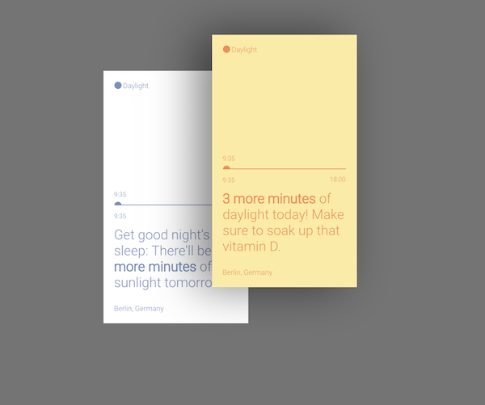

# Post-it exercise
You will create a page that rappresent a desk with 2 post-it on it

### Topics
HTML: HTML5 Semantic Elements  
CSS: border, box-shadow, color, background, z-index, pseudo-elements

### Design




### Bonus

```
/* Creating the circle at the timeline */

h6.sub::before {
    content: "";
    display: block;
    position: relative;
    border-radius: 50%;
    width: 10px;
    height: 10px;
    float: left;
}

```

Font: Roboto from Google Fonts